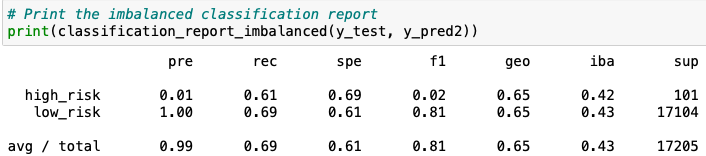
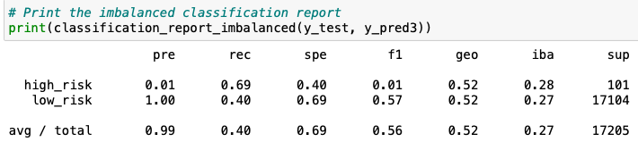
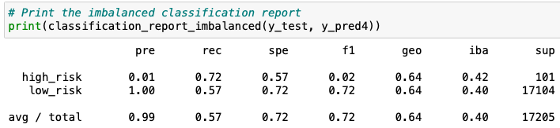
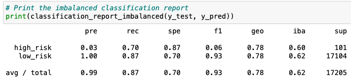
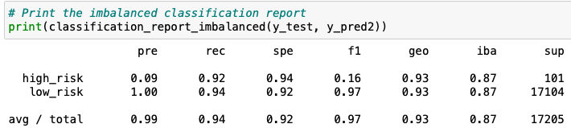

# Credit_Risk_Analysis
Using credit card data to predict credit risk.

## Overview of Analysis
For this project, we want to determine which machine learning process will best predict credit risk. We will use 6 different machine learning methods: RandomOversampler, SMOTE, ClusterCentroids, SMOTEENN, BalancedRandomForestClassifier, and EasyEnsembleClassifier. We want to see which of these different methods returned the best balanced accuracy scores, precision, and recall scores.

## Results
For RandomOversampler:
* .6403 balanced accuracy score
* .01 and 1 precision score for high risk and low risk respectively
* .66 and .62 recall score for high risk and low risk respectively

For SMOTE:
* .6515 balanced accuracy score
* .01 and 1 precision score for high risk and low risk respectively
* .61 and .69 recall score for high risk and low risk respectively

For ClusterCentroids:
* .5447 balanced accuracy score
* .01 and 1 precision score for high risk and low risk respectively
* .69 and .40 recall score for high risk and low risk respectively

For SMOTEENN:
* .6449 balanced accuracy score
* .01 and 1 precision score for high risk and low risk respectively
* .72 and .57 recall score for high risk and low risk respectively

For BalancedRandomForestClassifier:
* .7885 balanced accuracy score
* .03 and 1 precision score for high risk and low risk respectively
* .7 and .87 recall score for high risk and low risk respectively

For EasyEnsembleClassifier:
* .9327 balanced accuracy score
* .09 and 1 precision score for high risk and low risk respectively
* .92 and .94 recall score for high risk and low risk respectively

## Summary
Most of the models did not perform that well. The first four methods had a balanced accuracy score of about 65% or less each, which is not great. Almost all of the methods had the same precision for both high and low risk. The BalancedRandomForestClassifier performed better than the prior methods in regards to balanced accuracy score and recall for both high and low risk. But out of all the models, the EasyEnsembleClassifier performed the best in all aspects. It had the highest balanced accuracy score, the highest precision score for high and low risk, and the highest recall scores for high and low risk. While the precision score for high risk was the highest out of all of the methods, it still is not an ideal score (0.09). But, since it performed significantly better than the other tests, this is the method that I would choose to determine credit risk. 
