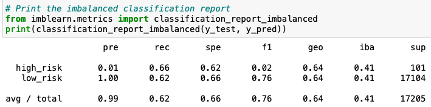

# Credit_Risk_Analysis
Using credit card data to predict credit risk.

## Overview of Analysis
For this project, we want to determine which machine learning process will best predict credit risk. We will use 6 different machine learning methods: RandomOversampler, SMOTE, ClusterCentroids, SMOTEENN, BalancedRandomForestClassifier, and EasyEnsembleClassifier. We want to see which of these different methods returned the best balanced accuracy scores, precision, and recall scores.

## Results
For RandomOversampler:
* .6403 balanced accuracy score
* .01 and 1 precision score for high risk and low risk respectively
* .66 and .62 recall score for high risk and low risk respectively

For SMOTE:
* .6515 balanced accuracy score
* .01 and 1 precision score for high risk and low risk respectively
* .61 and .69 recall score for high risk and low risk respectively

For ClusterCentroids:
* .5447 balanced accuracy score
* .01 and 1 precision score for high risk and low risk respectively
* .69 and .40 recall score for high risk and low risk respectively

For SMOTEENN:
* .6449 balanced accuracy score
* .01 and 1 precision score for high risk and low risk respectively
* .72 and .57 recall score for high risk and low risk respectively

For BalancedRandomForestClassifier:
* .7885 balanced accuracy score
* .03 and 1 precision score for high risk and low risk respectively
* .7 and .87 recall score for high risk and low risk respectively

For EasyEnsembleClassifier:
* .9327 balanced accuracys core
* .09 and 1 precision score for high risk and low risk respectively
* .92 and .94 recall score for high risk and low risk respectively

